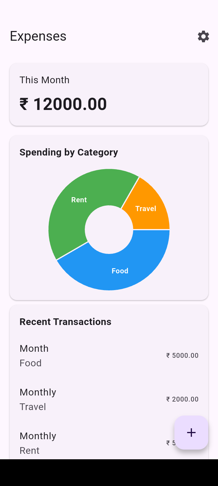
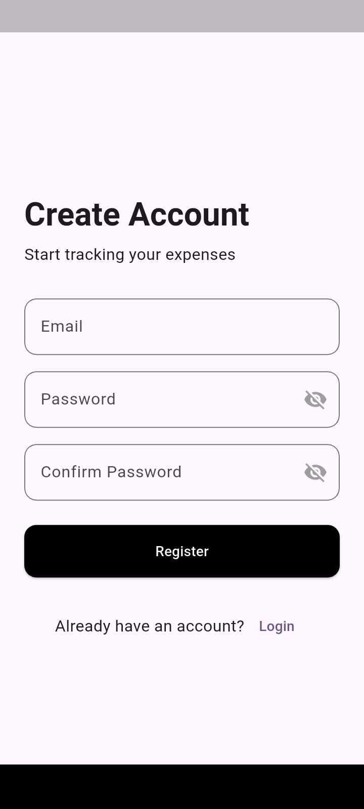
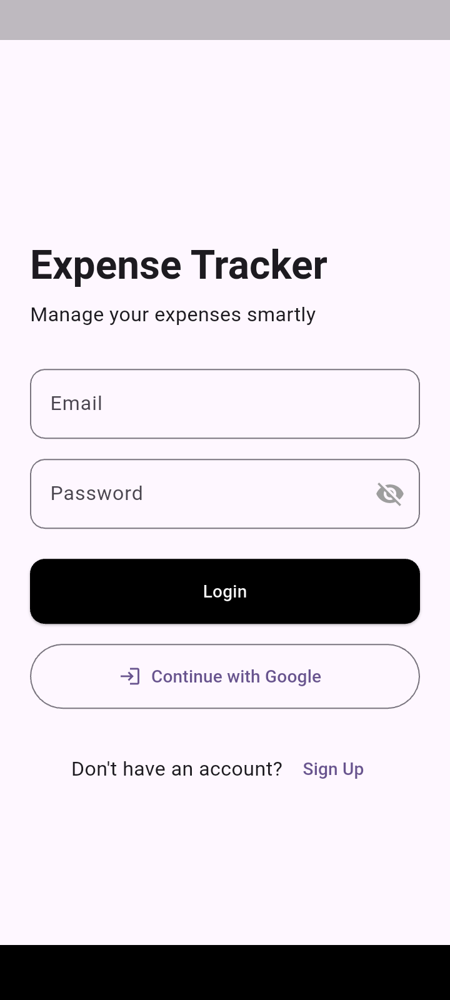
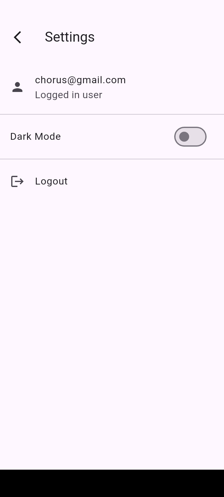

# Expense Tracker App

A production-ready Flutter expense tracking app built using Clean Architecture and BLoC.

## Features
- Email & Google authentication
- Add, edit, delete expenses
- Notes per expense
- Firestore sync + Hive local storage
- Monthly analytics & category charts
- Recent transactions
- Light/Dark theme toggle
- Responsive layout
- Settings & profile screen

## Tech Stack
- Flutter & Dart
- BLoC
- Firebase Auth & Firestore
- Hive
- Clean Architecture

## Screenshots

## Author
Chorus Rajbanshi
